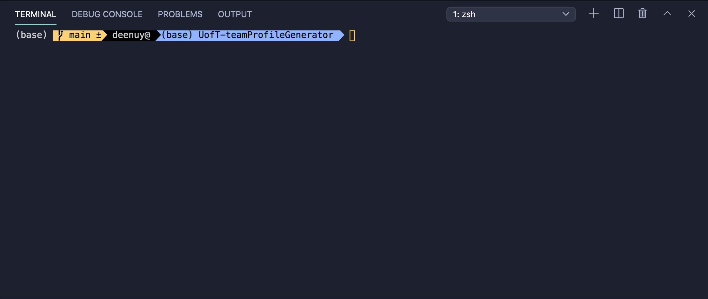
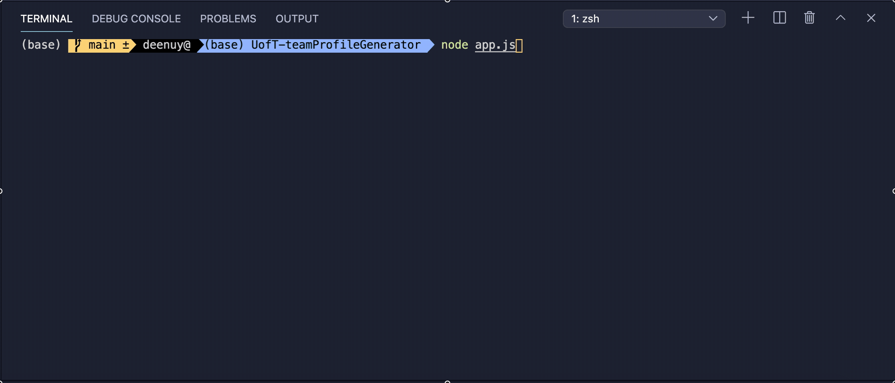
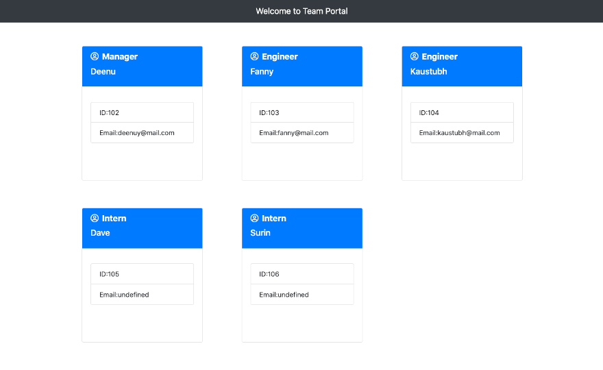

# UofT-teamProfileGenerator
A node-based command line interface (inquirer) app for generating software engineering team profile based on user input. The application will prompt the user for information about the team manager and the information about the team members. When the user has completed building the team, the application will create an HTML file that displays a nicely formatted team roster based on the information provided by the user.

## Usecase
As a manager
I want to generate a webpage that displays my team's basic info
so that I have quick access to emails and GitHub profiles

## Technology stack
node js
javascript
html
css
jest (automation unit testing)

## Usage
Clone the repository and follow below instructions
* npm install
* node app.js to run the inquirer
* Answer the questionnaires from the prompt
* On sucessful completion, it will generate html file in output folder with team profile

## Unit test
* run `npm test` to execute the unit tests and generate the result

## Demo

